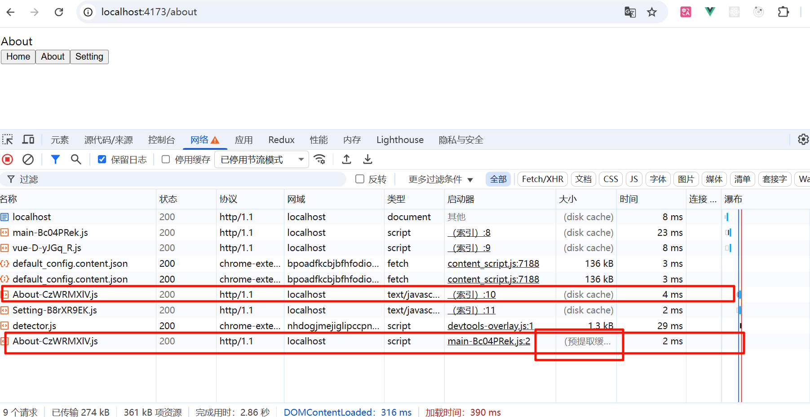

# 目录结构

plugin中为自己写的自定义插件


# vite-plugin-build-timer

构建计时器插件，控制台输出构建开始、以及耗时，同时将这些信息写入到一个json中放入到最终打包文件中


# vite-plugin-prefetch

将每个懒加载的二级页面的js作为预取资源插入到最终index.html（加上ref='prefetch'），从而实现首页空闲时预先加载所有二级页面的js资源，等到跳转到某二级页面需要import导入对应js时命中prefetch cache缓存，不发生网络请求，从而实现切换页面时的性能优化。

打包后最终index.html的内容

```html
<!DOCTYPE html>
<html lang="en">
<head>
    <meta charset="UTF-8">
    <meta name="viewport" content="width=device-width, initial-scale=1.0">
    <title>Document</title>
  <script type="module" crossorigin src="/static/js/main-Bc04PRek.js"></script>
  <link rel="modulepreload" crossorigin href="/static/js/vue-D-yJGq_R.js">
  <link rel="prefetch" as="script" href="/static/js/About-CzWRMXlV.js" crossorigin>
  <link rel="prefetch" as="script" href="/static/js/Setting-B8rXR9EK.js" crossorigin>
</head>

<body>
    <div id="app"></div>
</body>
</html>
```

> 注意：一定要加上crossorigin，因为浏览器对<script type="module"> 的模块脚本、`import()` 动态导入的脚本采用的是CORS模式（即使没有跨域），对于<script>传统脚本、<link>等静态资源采用的是no-cors 模式，如果<link ref='prefetch’>不加crossorigin放入prefetch cache中的cors与之后进入该页面时import的js的cors维度不一致，而无法复用缓存

预览时的效果



